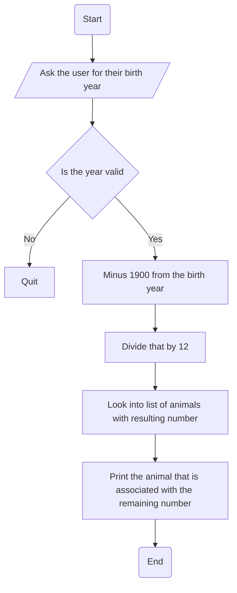

```mermaid
flowchart TD
s(Start) --> a[/Ask the user for their birth year/]
a --> b{Is the year valid}
b --> |No| c[Quit]
b --> |Yes| d[Minus 1900 from the birth year]
d --> e[Divide that by 12]
e --> f[Look into list of animals with resulting number]
f --> g[Print the animal that is associated with the remaining number]
g --> h(End)
```
