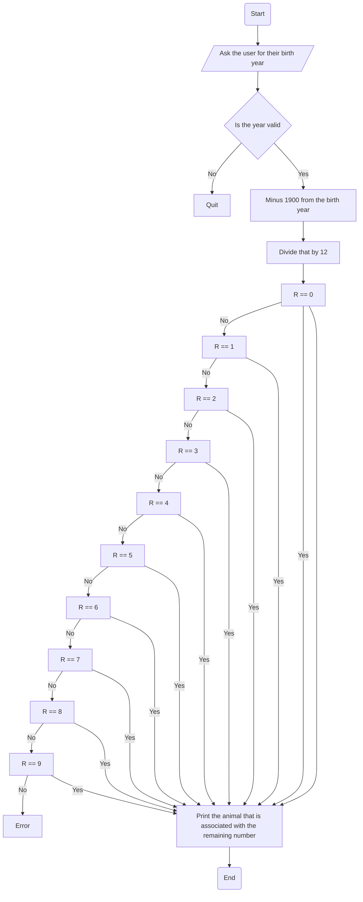

```mermaid
flowchart TD
s(Start) --> a[/Ask the user for their birth year/]
a --> b{Is the year valid}
b --> |No| c[Quit]
b --> |Yes| d[Minus 1900 from the birth year]
d --> e[Divide that by 12]
e --> f[R == 0]

f --> |No| g[R == 1]
f --> |Yes| y

g --> |No| h[R == 2]
g --> |Yes| y

h --> |No| i[R == 3]
h --> |Yes| y

i --> |No| j[R == 4]
i --> |Yes| y

j --> |No| k[R == 5]
j --> |Yes| y

k --> |No| l[R == 6]
k --> |Yes| y

l --> |No| m[R == 7]
l --> |Yes| y

m --> |No| n[R == 8]
m --> |Yes| y

n --> |No| o[R == 9]
n --> |Yes| y

o --> |No| p[Error]
o --> |Yes| y

f --> y[Print the animal that is associated with the remaining number]
y --> z(End)
```

